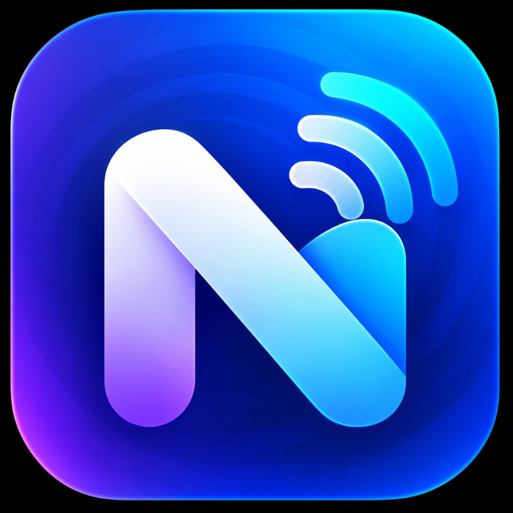

# ⚡ NearBeam

<p align="center">
  
</p>

<p align="center">
  <strong>Ultra-fast, zero-cloud Wi-Fi file transfers & shared folder explorer across Windows, iOS, Android, macOS & Linux.</strong>
</p>

<p align="center">
  <a href="https://github.com/tanumay-deb/NearBeam/releases/latest"></a>
  <a href="https://github.com/tanumay-deb/NearBeam/blob/main/LICENSE"></a>
  
  
  
</p>

---

## 💡 Why NearBeam?

Tired of emailing files to yourself, uploading GBs to cloud drives just to download them to your phone, or fighting proprietary AirDrop/Quick Share barriers?

**NearBeam** turns any computer into a blazing-fast local Wi-Fi drop zone with a beautiful web client. **No app installation is required on your phones or tablets**—just open your browser, connect, and beam files at maximum Wi-Fi speeds (30–100+ MB/s).

---

## ✨ Superpowers

| Feature | Description |
|:---|:---|
| ⚡ **Socket-Stream Speed** | Direct socket-to-disk TCP streaming with parallel 50MB chunks. Zero double-buffering disk penalties—saturates your gigabit Wi-Fi. |
| 🏷️ **Permanent Address** | Bookmark **`http://nearbeam.local:5000`** on Safari, Chrome, or Firefox. mDNS automatically tracks your PC even when your router DHCP assigns a new IP! |
| 🛸 **Multi-Host Mesh Cluster** | Run NearBeam on your PC and Laptop simultaneously. They auto-discover each other; mobile clients pick the destination computer with one tap (`[ Desktop ] [ Laptop ] [ All Hosts ]`). |
| 🔒 **Safe List Sandboxed Explorer** | Share specific folders or external drives. Browsers can navigate subfolders, stream media, and download whole directories as auto-packaged ZIPs. |
| 🎁 **Guest Drop Zones** | Generate temporary, expiring drop links. Guests can securely drop files to you without seeing your computer's files or Safe List. |
| 📥 **Zero-Click Auto-Save** | Received files automatically save to your designated folder (`Downloads/NearBeam_Received`) with smart numbered duplicate protection (`photo (1).jpg`). |
| 📁 **Folder Drag-and-Drop** | Drag nested folders directly from your browser. NearBeam recursively reconstructs the exact folder hierarchy on your disk. |
| 📋 **Universal Shared Clipboard** | 1-tap clipboard synchronization between Windows, Mac, Linux, iPhone, iPad, and Android. |
| 🖥️ **Dual Mode** | Sleek PySide6 Desktop GUI with system tray minimization, or headless CLI server (`--headless`) for remote servers and Raspberry Pi. |

---

## 📊 Feature Comparison

| Feature | ⚡ NearBeam | Apple AirDrop | Google Quick Share | Cloud Drives (Drive/Dropbox) |
|:---|:---:|:---:|:---:|:---:|
| **Cross-Platform (Windows, Mac, iOS, Android)** | ✅ **Yes** (Any browser) | ❌ Apple only | ❌ Android/Windows only | ✅ Yes |
| **Mobile App Install Required?** | ❌ **No (Web Native)** | ✅ Built-in only | ✅ Required | ✅ App required |
| **Cloud / Internet Required?** | ❌ **100% Local Wi-Fi** | ❌ Offline only | ❌ Offline only | ⚠️ Needs Internet |
| **File Size Limit** | 🚀 **Unlimited** | 🚀 Unlimited | 🚀 Unlimited | ⚠️ Quota capped |
| **Multi-PC Mesh Clustering** | ✅ **Built-in** | ❌ No | ❌ No | ❌ No |
| **Shared Safe Folders & In-browser Playback** | ✅ **Built-in** | ❌ No | ❌ No | ⚠️ Slow cloud sync |
| **One-Click Guest Drop Links** | ✅ **Built-in** | ❌ No | ❌ No | ⚠️ Complex permissions |

---

## 🚀 Quick Start & Installation

### Option 1: 1-Line Windows Web Installer *(Recommended — No Python Needed)*
Open **PowerShell** and paste this single command:
```powershell
irm https://raw.githubusercontent.com/tanumay-deb/NearBeam/main/install.ps1 | iex
```
*This queries the latest release, downloads the Windows Setup installer, and configures everything automatically.*

---

### Option 2: Windows Setup Installer (`.exe`)
Download **`NearBeam-v1.4.0-Setup.exe`** from the [GitHub Releases](https://github.com/tanumay-deb/NearBeam/releases) page. Run the installer to get:
- Start Menu & Desktop shortcuts
- Optional background startup on Windows login
- Automatic Windows Firewall configuration

---

### Option 3: Terminal Install (`pip`)
```bash
pip install git+https://github.com/tanumay-deb/NearBeam.git
```
Then launch anywhere from your terminal:
```bash
nearbeam
```

---

### Option 4: Run from Source
```bash
git clone https://github.com/tanumay-deb/NearBeam.git
cd NearBeam
pip install -r requirements.txt
python main.py
```
*(For headless/server mode without desktop window: `python main.py --headless`)*

---

## 📱 Connecting From Your Phone (In 3 Seconds)

1. Make sure your phone/tablet is connected to the **same Wi-Fi** as your computer.
2. Open Safari (iOS) or Chrome (Android) and visit:
   - **⭐ Permanent Address:** `http://nearbeam.local:5000` *(Bookmark this!)*
   - **👉 Direct IP:** `http://192.168.1.10:5000` *(Check NearBeam app for your exact IP)*
   - **🔍 Subnet Auto-Finder:** Visit `http://<any-ip>:5000/finder` to automatically sweep and reconnect.
3. **Drop files** to send them instantly, or **explore shared folders** on your PC!

---

## 🛡️ Security & Privacy

- **100% Local LAN Communication:** Transfers never route through any external server, cloud relay, or third-party tracking.
- **Strict Directory Sandboxing:** The Safe List explorer verifies and canonicalizes all paths. Any path traversal attack attempts (`../`, symlink attacks) are strictly rejected with HTTP 403.
- **Optional PIN Authentication:** Lock access to your Safe List and uploads behind a custom PIN configured right in the desktop app.
- **Isolated Guest Tokens:** Guest drop links use cryptographically random UUID tokens that expire in 24 hours. Guests have zero access to your file explorer.

---

## 🧪 Development & Testing

NearBeam includes an extensive end-to-end and unit test suite covering chunked uploads, mesh cluster election, clipboard synchronization, and folder traversal security:

```bash
python -m unittest discover tests
```

To build a standalone Windows binary:
```bash
python -m PyInstaller --noconfirm NearBeam.spec
```

---

## 📄 License

Distributed under the **MIT License**. Created with ❤️ by [Tanumay Goswami](https://github.com/tanumay-deb).
